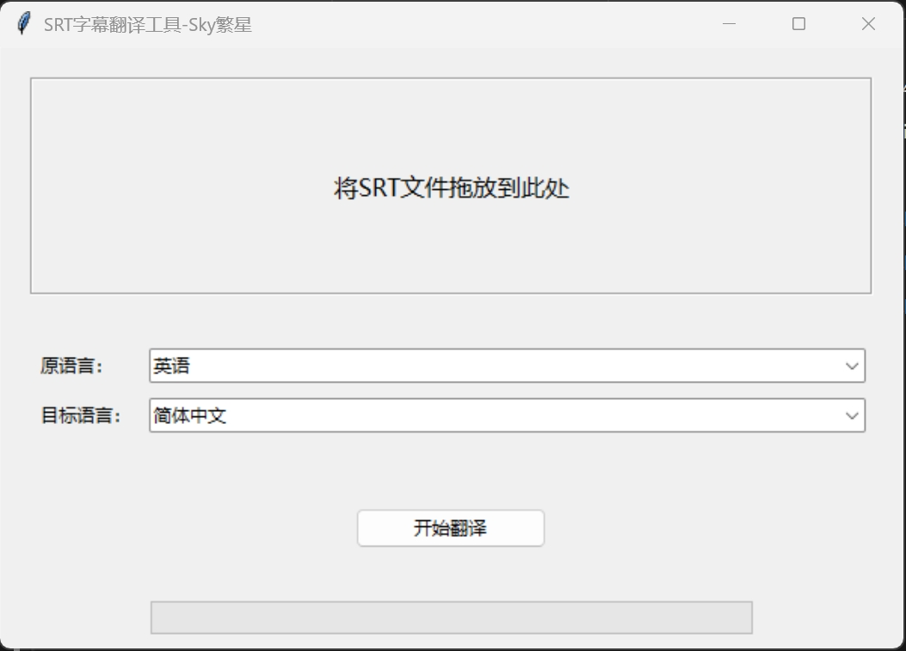
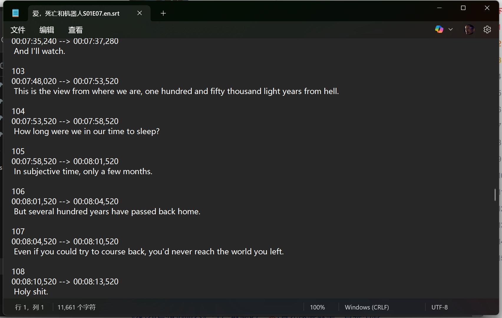
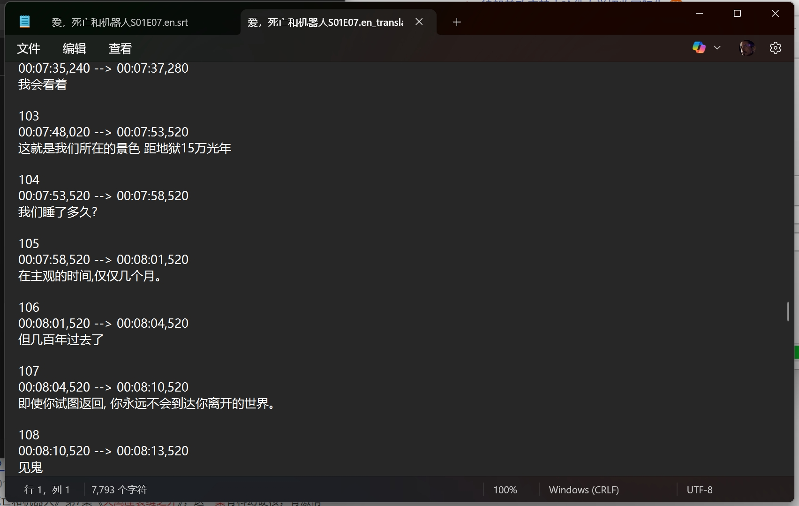

# SRT字幕翻译工具

## 功能简介
本工具是一款基于Python开发的SRT字幕文件翻译工具，支持通过拖放操作快速导入SRT文件，并提供多语言互译功能（支持简体中文、英语、日语、韩语、俄语）。翻译完成后自动生成`_translated.srt`后缀的目标语言字幕文件。

## 使用模型
核心翻译功能基于[Argos Translate](https://github.com/argosopentech/argos-translate)开源机器翻译库实现，支持离线翻译。

## 界面演示
### 主界面

### 原文件

### 翻译效果

## 下载链接
[点击此处下载最新版exe安装包](https://download.csdn.net/download/weixin_45826970/90890917?spm=1001.2014.3001.5501)

## 注意事项
- 模型文件已经尽可能小，但还是需要一点时间加载，耐心等待。
- 当翻译开始时程序出现未响应状态，这是正常现象，请勿关闭程序。
- 翻译完成后，会自动生成`_translated.srt`后缀的目标语言字幕文件，并保存到源文件目录。
